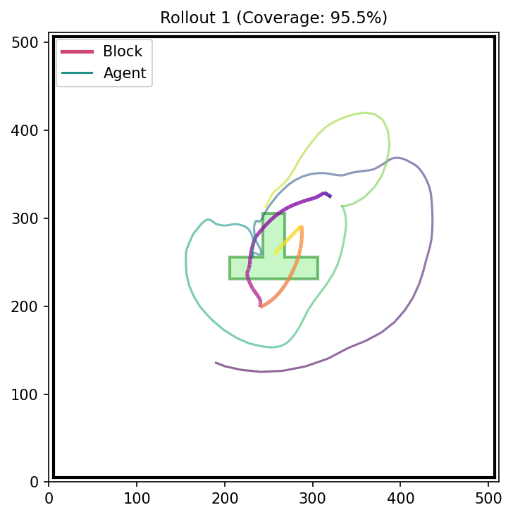

# Diffusion Policy with Flow Matching

An empirical study of visuomotor policy learning: reproduce a DDPM policy, replace its denoising objective with flow matching, and examine the speed–quality tradeoff on PushT. A separate real-robot study uses the DDPM baseline on a UR10e.

**Start here:** [saved results](#results-you-can-inspect) · [implementation](#implementation-and-attribution) · [reproduction](#reproduction) · [evaluation notes](docs/evaluation_notes.md)

## Results you can inspect

The committed evaluation files report the following PushT results. Each experiment uses 50 evaluation episodes; the study is primarily single-seed. These are historical measurements, not a new training run.

| Configuration | Sampling steps | Mean score ↑ | Mean maximum coverage ↑ | Sampler p50 ↓ |
| --- | ---: | ---: | ---: | ---: |
| [DDPM UNet](results/ddpm_unet_s42/eval_results.json) | 100 | 0.8158 | 0.7811 | 635.05 ms |
| [FM UNet, learning rate 5e-5](results/fm_lr5e-5/eval_results.json) | 4 | 0.7980 | 0.7610 | 23.14 ms |
| [FM UNet](results/fm_steps8/eval_results.json) | 8 | 0.7687 | 0.7350 | 45.33 ms |
| [FM UNet](results/fm_steps16/eval_results.json) | 16 | 0.7936 | 0.7580 | 90.43 ms |

The four-step, lower-learning-rate FM run retains **97.8% of the baseline score** with **27.45× lower recorded p50 sampler latency**. It changes both the training objective and sampling budget; this is not an equal-step sampler comparison. Both timers cover the action sampler, excluding observation encoding and action postprocessing. The recorded time is not full-policy latency or a measured robot control frequency. The saved JSON does not include complete hardware/timing provenance, so cross-device performance claims require a new matched run.

Inspect all seven experiment summaries with Python's standard library:

```bash
git clone https://github.com/thedannyliu/Diffusion-Policy.git
cd Diffusion-Policy
python scripts/summarize_results.py
```

Example rollout from the four-step FM run:



The [full per-episode log](results/fm_lr5e-5/eval_log_full.json) and [ablation report](docs/results.md) provide context beyond this example. The historical `test_success_rate` field is invalid: the old runner counted time-limit termination as success. It is excluded from this summary; the runner now reads explicit environment success flags for future evaluations. Historical JSON files remain unchanged for provenance.

## Implementation and attribution

This is a Georgia Tech CS 8803 Deep Reinforcement Learning team project built on [Diffusion Policy by Chi et al.](https://github.com/real-stanford/diffusion_policy). The upstream implementation and license are retained under [`diffusion_policy/`](diffusion_policy). Flow matching builds on the published method; this repository studies its application to this policy architecture.

| Component | Where to review |
| --- | --- |
| Conditional flow matching loss | [`dpfm/loss/flow_matching_loss.py`](dpfm/loss/flow_matching_loss.py) |
| Euler integration sampler | [`dpfm/sampler/euler_sampler.py`](dpfm/sampler/euler_sampler.py) |
| UNet policy integration | [`dpfm/policy/flow_matching_unet_hybrid_image_policy.py`](dpfm/policy/flow_matching_unet_hybrid_image_policy.py) |
| Shared evaluation and export of metrics | [`dpfm/eval.py`](dpfm/eval.py) |
| Experiment configurations | [`dpfm/config`](dpfm/config) |
| Task-success regression check | [`tests/test_task_success.py`](tests/test_task_success.py) |

The extension keeps the conditional UNet architecture and observation interface, changes the target from noise to velocity, and generates action chunks using a short Euler integration. Configuration files expose learning rate, sampling steps, seed, and training settings for ablations.

## Reproduction

### Inspect results and validate metric logic on a CPU

```bash
python scripts/summarize_results.py
PYTHONPATH=diffusion_policy python -m unittest discover -s tests -v
```

These commands require no GPU, checkpoint, dataset, or third-party Python package. They inspect saved measurements and test task-success aggregation; they do not rerun the policies.

### Train or evaluate a policy

The training stack is legacy research software. Start from the [upstream environment file](diffusion_policy/conda_environment.yaml) and [installation/data instructions](diffusion_policy/README.md), then check the extension [requirements](requirements.txt). A fresh end-to-end training installation has not been validated by the CPU checks above.

The PushT config expects the replay dataset at `diffusion_policy/data/pusht/pusht_cchi_v7_replay.zarr`, because the training entry point changes into the vendored `diffusion_policy` directory. You can override `task.dataset.zarr_path` with an absolute path.

From the repository root in the configured training environment:

```bash
python -m dpfm.train --config-name=train_fm_unet_hybrid_image_workspace \
  policy.num_inference_steps=4 optimizer.lr=5e-5 training.seed=42

python -m dpfm.eval --checkpoint /absolute/path/to/model.ckpt \
  --output_dir eval_output --n_test 50 --device cuda:0 --wandb_mode disabled
```

Trained checkpoints and real-robot demonstrations are not bundled. Reproducing the policies requires obtaining the corresponding data and training or supplying a compatible checkpoint.

## Real-robot study

The existing project write-up describes DDPM evaluation on a UR10e with dual RGB camera observations, SpaceMouse demonstrations, and cube/sphere pushing into goal slots. **Flow Matching was evaluated in PushT simulation only.** A robot demo should therefore identify which policy is running.

The historical write-up reports 32/32 successes for each object in the two-camera interior-position trials. Boundary-trial counts are inconsistent (18 positions versus denominators of 19), and trial-level records are not committed. The [evaluation notes](docs/evaluation_notes.md) preserve these unresolved details; the counts should be reconciled before using an overall real-robot success claim.

## What the experiments do and do not establish

- Four-step FM is a promising operating point in these saved runs. Multiple training seeds are needed to quantify uncertainty.
- Learning rate changes materially affect the result. The best four-step row is not a controlled step-count-only ablation.
- The tested FM Transformer configuration performs poorly. One configuration does not establish that Transformers cannot learn flow-matching policies.
- A measured speed–quality tradeoff in PushT does not demonstrate real-world FM deployment or generalization to other manipulation tasks.

See [evaluation notes](docs/evaluation_notes.md) for metric definitions, evidence gaps, and the next reproducibility checks.
